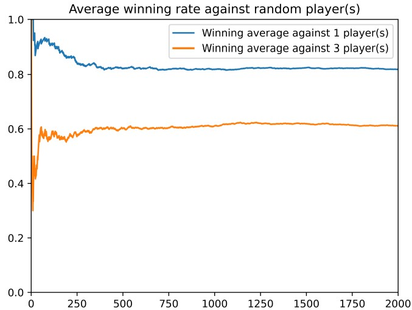

# Reinforcement Learning in the Game of Ludo
Q-learning AI player for the LUDO board game. 
This project was part of the course Tools for Artificial intelligence at SDU.
The report is [here](Reinforcement_Learning_in_the_Game_of_Ludo.pdf)

# Overview
The task was to develop an AI player which would lean how to play the board game LUDO using a common reinforcement approach. The player is realized iwth Q-learning, a model free reinforcement technique. By repeated retrying all actions in all states with a long-term dis-
count reward, it learns which is the best overall action. To apply Q-learning,the game has to be in state space representation. 

# States
|State |Description                                                                                                          |
|------|---------------------------------------------------------------------------------------------------------------------|
|Home  | Piece is in home location                                                                                           |
|Safe  | The piece can’t get killed by an opponent, this is the case if it is”protected”, ”on a globe”, or ”in the goal zone”|
|Unsafe| The piece is not safe, but can’t be reachedby an opponent player within one dice roll                               |
|Danger| The piece not safe and within the range of one dice roll of the opponent                                     |

# Actions
|Action|Reward                                                                                                               |Description                                                             |
|------|---------------------------------------------------------------------------------------------------------------------|------------------------------------------------------------------------|
|Move out| 0.25                                                                                                                | Moving token out from Home position                                    |
|Normal| 0.01                                                                                                                | Moving eyes of dice on board                                           |
|Goal  |0.8                                                                                                                  |Moving to goal position                                                 |
|Star  |0.5                                                                                                                  |Move to star, this results in a ”jump” to the next star                 |
|Globe |0.4                                                                                                                  | Move to a safe point                                                   |
|Protect| 0.3                                                                                                                 | Move to a point where another piece as yourself is (can not get killed)|
|Kill  |0.4                                                                                                                  | Kill an opponent piece                                                 |
|Die   |0                                                                                                                    | Move to field where opponent is safe, e.g. protect or globe             |
|Goal Zone |0.4                                                                                                                  | Move into goal zone                                                    |
|Nothing |0                                                                                                                    |No action is possible                                                   |

# Results
